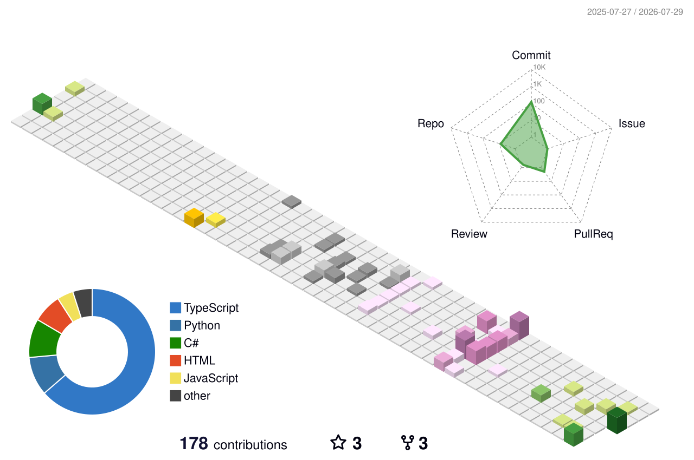

<!-- Başlığın altındaki GIF/PP yerine kendi resmini ya da GIF'ini ekleyebilirsin -->
<h1 align="center">Hi there, I'm Berke 👋</h1>

  <em>Computer Engineering 4th-year student @ Akdeniz University · Cyber-security & backend developer</em>

### 🚀 About Me  
- 🔭 I’m currently building a **Website Builder** and an **AI Chatbot** (Node.js + Angular)  
- 🛡️ Passionate about **cyber-security** & **backend architecture**  
- 🌱 Learning **React Native** for mobile dev  
- 💬 Ask me about **Node, .NET, FastAPI, MongoDB, Packet Tracer…**   

### 🛠️ Tech Stack

### 📌 Pinned Projects
<!-- Repo adlarını değiştir -->

### 📫 Reach Me

<h2 align="center">📊 My GitHub Contributions</h2>

  

