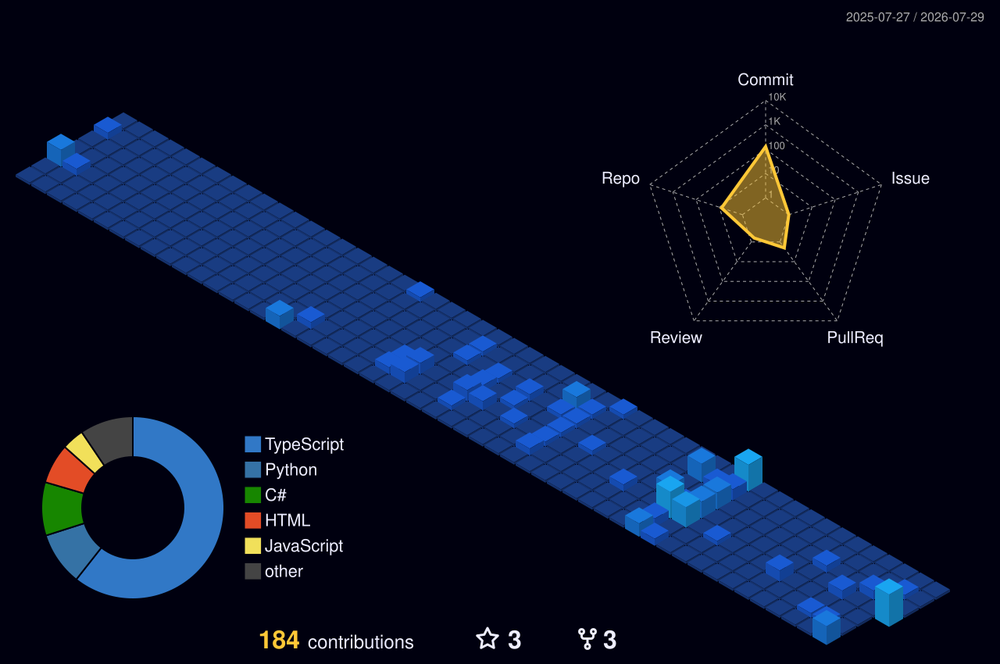

  

  
  
  

---

## About Me

I am a senior Computer Engineering student at Akdeniz University, focused on building reliable, practical and secure software.

* Developing Android applications with **Kotlin**, **Jetpack Compose**, **MVVM** and **Clean Architecture**
* Experienced in backend development, REST APIs, databases and cloud-based systems
* Interested in mobile security, cybersecurity, artificial intelligence and IoT technologies
* Building projects that combine software engineering with real-world problems

---

## Technologies

  

---

## Featured Projects

<table>
  <tr>
    <td width="50%" valign="top">
      <h3 align="center">
        <a href="https://github.com/berkeerenc/PhysioVision">PhysioVision</a>
      </h3>
      

        AI-powered physical rehabilitation platform that evaluates exercise quality using computer vision and provides real-time feedback.
      

      

        <code>Python</code>
        <code>Flask</code>
        <code>React</code>
        <code>TensorFlow</code>
        <code>MediaPipe</code>
        <code>PostgreSQL</code>
      

    </td>
    <td width="50%" valign="top">
      <h3 align="center">
        <a href="https://github.com/berkeerenc/AiKnock">AiKnock</a>
      </h3>
      

        An interactive AI experience combining contextual RAG conversations, sentiment analysis, dynamic lyric generation and generative music.
      

      

        <code>Next.js</code>
        <code>TypeScript</code>
        <code>FastAPI</code>
        <code>Gemini</code>
        <code>RAG</code>
      

    </td>
  </tr>
  <tr>
    <td width="50%" valign="top">
      <h3 align="center">
        <a href="https://github.com/berkeerenc/HisseNabiz">HisseNabız</a>
      </h3>
      

        A Borsa İstanbul analysis platform offering charts, technical indicators, AI-supported market commentary and trading signals.
      

      

        <code>React</code>
        <code>TypeScript</code>
        <code>Node.js</code>
        <code>PostgreSQL</code>
        <code>Gemini</code>
      

    </td>
    <td width="50%" valign="top">
      <h3 align="center">
        <a href="https://github.com/berkeerenc/ServerlessMonitoring">Serverless Monitoring</a>
      </h3>
      

        A cloud-based service health monitoring system built with serverless Azure technologies and infrastructure as code.
      

      

        <code>.NET 8</code>
        <code>Azure Functions</code>
        <code>Cosmos DB</code>
        <code>Bicep</code>
        <code>CI/CD</code>
      

    </td>
  </tr>
</table>

  

---

## GitHub Contributions

  

---

  <em>Always learning, building and improving.</em>

