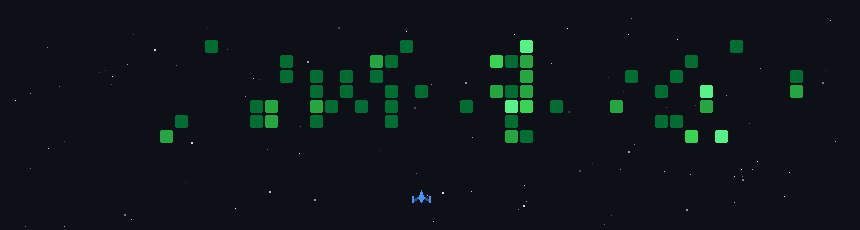

  

  
  
  

 

## About Me

Computer Engineering graduate focused on **backend development**, **full-stack applications** and **AI-powered systems**.

I enjoy designing reliable APIs, working with modern web technologies and turning practical ideas into usable software. My projects span artificial intelligence, real-time applications and data-driven platforms.

 

## Tech Stack

  

 

## Featured Projects

<table>
  <tr>
    <td width="50%" valign="top">
      <h3 align="center">
        <a href="https://github.com/berkeerenc/PhysioVision">
          PhysioVision
        </a>
      </h3>
      

        AI-powered rehabilitation platform that evaluates exercise form in real time using pose detection and LSTM-based classification.
      

      

        <code>React</code>
        <code>Flask</code>
        <code>TensorFlow</code>
        <code>MediaPipe</code>
        <code>PostgreSQL</code>
      

    </td>

    <td width="50%" valign="top">
      <h3 align="center">
        <a href="https://github.com/berkeerenc/Football_Matchmaking_and_Scouting_Application">
          Football Matchmaking
        </a>
      </h3>
      

        Full-stack platform for organizing football matches, real-time communication, player ratings and scouting.
      

      

        <code>.NET 8</code>
        <code>React</code>
        <code>PostgreSQL</code>
        <code>SignalR</code>
        <code>JWT</code>
      

    </td>
  </tr>

  <tr>
    <td width="50%" valign="top">
      <h3 align="center">
        <a href="https://github.com/berkeerenc/chatbot">
          AI-Powered Hotel Chatbot
        </a>
      </h3>
      

        Multilingual hotel assistant with dynamic switching between LLaMA, Mistral and GPT models.
      

      

        <code>Node.js</code>
        <code>JavaScript</code>
        <code>Multi-LLM</code>
        <code>REST API</code>
      

    </td>

    <td width="50%" valign="top">
      <h3 align="center">
        <a href="https://github.com/berkeerenc/WebsiteBuilder">
          Website Builder & Cloner
        </a>
      </h3>
      

        Hotel website generation platform combining template-based creation with automated website cloning and content extraction.
      

      

        <code>Node.js</code>
        <code>Angular</code>
        <code>MongoDB</code>
        <code>Puppeteer</code>
        <code>Cheerio</code>
      

    </td>
  </tr>
</table>

  

 

## GitHub Activity

  

 

  <em>Building, learning and improving one project at a time.</em>

